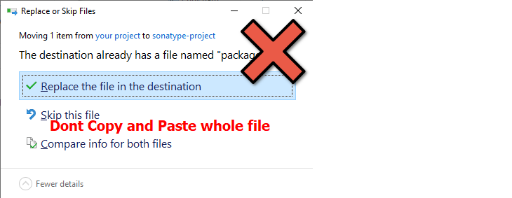
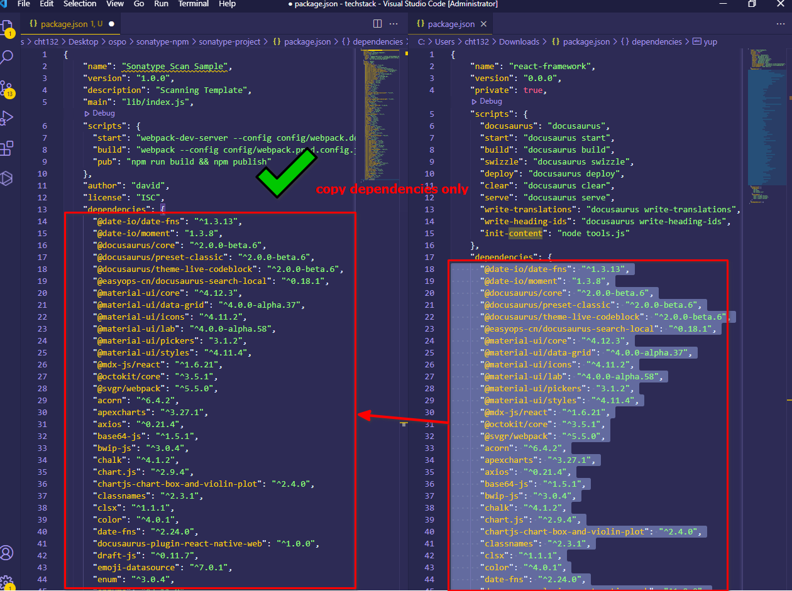
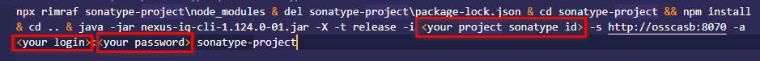
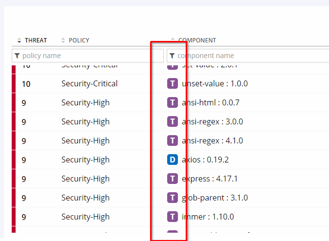

# Sonatype scan template (NPM)
Sonatype scanning template for NPM

### Prerequisite

1. Your workstation able to run `npx` command
2. proxy config ready. npm command able to access internet
3. java 8 installed
4. Sonatype account & application ID ready (http://osscasb:8070)

### Steps

1. Download this project

2. Copy your application libraries into `sonatype-project/package.json` "dependencies" field, dont replace the whole file

   - Please dont add `react-scripts`, it is use for generate, build project
   - Remove all libraries version with "^"

   

   

3. Edit `sonatype-scan.bat` file, change sonatype id, login, password

   

4. Run `sonatype-scan.bat`, report should be on [Sonatype](http://osscasb:8070)

5. Your application report should able to display "T" and "D"

   
